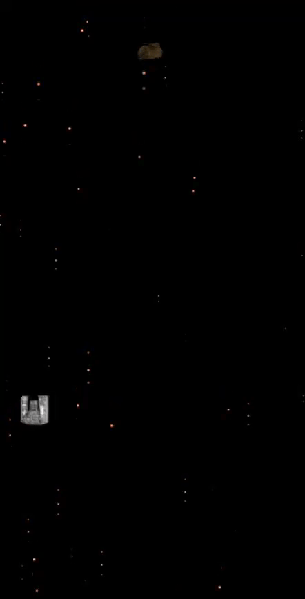

# android ndk practice - droidblaster
This is a demo folder hosting past practice project. Only the core source code are host without build scripts or third party libraries (such as libpng and Box2D physics engine).

The game was instructed by the book Android NDK Beginner's Guide by Packtpub.

